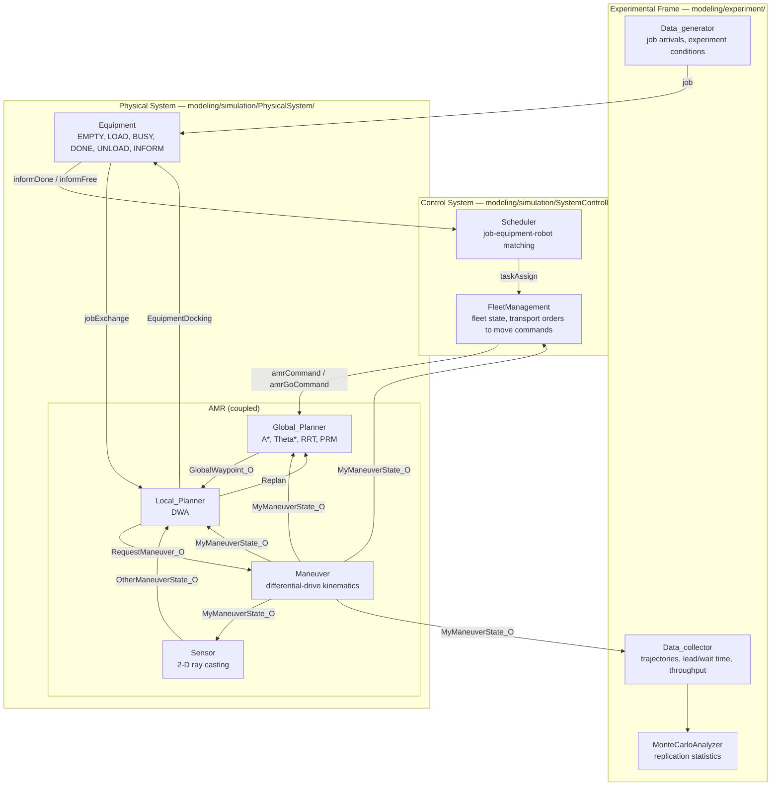

# A DEVS-based Simulation Framework for Evaluating Path Planning Algorithms in Autonomous Mobile Robot Operations

[](LICENSE)
[](https://www.python.org/)
[](#simulation-engine)

Reference implementation for the article

> **A DEVS-based simulation framework for evaluating path planning algorithms in autonomous mobile robot operations**
> Min-ho Choi, Jin-hyeon Sung, Im-seok Lee, Kyung-min Seo\*
> *Manuscript under review, 2026.*

---

## Overview

Path planning determines how an autonomous mobile robot (AMR) moves, and its effect is not
confined to a single trajectory. In production and logistics systems a path planner interacts
with dynamic obstacles, fleet control and job scheduling, so algorithm-level performance has to
be evaluated together with operation-level outcomes.

This repository implements a simulation framework, based on the **Discrete Event System
Specification (DEVS)** formalism, that evaluates global and local path planning algorithms
consistently — from a single robot in a static map up to a multi-robot fleet running a
cell-type flexible flow shop. Perception, planning, maneuvering, fleet management, scheduling
and equipment operation are all represented as coupled discrete-event models, and a **unified
planner interface** lets global and local algorithms be swapped without touching the surrounding
models.

Two properties make the framework useful as an evaluation testbed:

- **One model, many planners.** The robot model, the environment and the operation logic stay
  fixed while only the planner is replaced, so performance differences are observed under
  controlled conditions.
- **One model, two evaluation levels.** The layering keeps the robot model independent of the
  control and operation models, so an algorithm-level experiment is a matter of instantiating
  the AMR on its own. This release ships the operation-level driver; see
  [Scope of this release](#scope-of-this-release).

## Architecture

The framework is organised into three layers, matching Fig. 1 of the article.



`AMRSimModel` is the outermost coupled model; it wires the Experimental Frame to the
Simulation Model, which in turn contains the Control System, every `AMR` instance and every
`Equipment` instance. A detailed model-by-model specification — states, ports and time-advance
behaviour — is in **[docs/ARCHITECTURE.md](docs/ARCHITECTURE.md)**.

### Simulation engine

`SimulationEngine/` is a self-contained Python DEVS kernel. It provides Classic DEVS
(`ClassicDEVS/`), Dynamic Structure DEVS (`DynamicDEVS/`) and Multi-Resolution DEVS
(`MRDEVS/`) base classes, an event-driven scheduler, a coupling graph and a Matplotlib-based
live visualiser. The AMR models in `modeling/` are built entirely on these base classes.

## Repository layout

```
.
├── main.py                       # Entry point: Monte Carlo / fleet-size sweep driver
├── JSON/                         # Experiment configuration (see docs/CONFIGURATION.md)
│   ├── setup.json                #   replications, fleet size, run modes
│   ├── map.json                  #   shop-floor layout: equipment, ports, waiting areas
│   ├── processInfo.json          #   process sequences and machine performance factors
│   └── vehicleInfo.json          #   robot spawn poses and vehicle/planner parameters
│
├── SimulationEngine/             # DEVS kernel (formalism level, domain independent)
│   ├── ClassicDEVS/              #   DEVSModel, DEVSAtomicModel, DEVSCoupledModel, DEVSCoupling
│   ├── DynamicDEVS/              #   dynamic-structure coupled model
│   ├── MRDEVS/                   #   multi-resolution atomic/coupled models
│   ├── Utility/                  #   Configurator, Event, Logger
│   ├── Visualzer/                #   live Matplotlib visualiser
│   ├── CouplingGraph.py          #   coupling node/edge resolution
│   └── SimulationEngine.py       #   event scheduler and simulation loop
│
├── modeling/                     # Domain models (Fig. 1 of the article)
│   ├── AMRSimModel.py            #   outermost coupled model
│   ├── Message/                  #   message/event payload classes
│   ├── experiment/               #   Experimental Frame
│   │   ├── experimental_frame.py
│   │   ├── MonteCarloAnalyzer.py #   replication statistics and figures
│   │   └── atomic/               #   Data_generator, Data_collector
│   └── simulation/
│       ├── simulation_model.py   #   Control System + Physical System composition
│       ├── SystemController/     #   FleetManagement, Scheduler, TransportCommand
│       └── PhysicalSystem/
│           ├── Vehicle.py        #   AMR coupled model
│           ├── Vehicle_Planner.py#   Planner coupled model (GPP + LPP)
│           ├── Equipment.py      #   process equipment atomic model
│           └── atomic/           #   Sensor, Global_Planner, Local_Planner, Maneuver
│
├── Algorithm/PathPlanning/       # Path planning algorithms behind the unified interface
│   ├── global_path/              #   A_star, Theta_star, RRT, PRM, ACO, GA, utils
│   └── Local_path/               #   DWA
│
├── Environment/                  # EnvironmentLoader: JSON to Configurator
├── SharedData/                   # GlobalVar: cross-model shared state and counters
├── Visualizations/               # Simulation outputs + trajectory replay script
│   ├── visualize.py              #   post-hoc trajectory animation / figures
│   └── 20260106_142518/          #   bundled example run (see docs/OUTPUTS.md)
└── docs/                         # Architecture, configuration and output documentation
```

## Requirements

| | |
|---|---|
| Python | 3.8 or newer (developed and tested on **3.11.6**, Windows 11 x64) |
| Packages | `numpy`, `shapely`, `matplotlib`, `scipy`, `pandas` |

Exact versions the framework has been exercised with: `numpy 2.4.5`, `shapely 2.1.2`,
`matplotlib 3.10.9`, `scipy 1.17.1`. Only the standard scientific Python stack is required —
no ROS, no simulator binaries, no GPU.

## Installation

```bash
git clone https://github.com/minhochoe66/DEVS_simulation_framework.git
cd DEVS_simulation_framework

python -m venv .venv
# Linux/macOS
source .venv/bin/activate
# Windows PowerShell
.\.venv\Scripts\Activate.ps1

pip install -r requirements.txt
```

## Quick start

Run from the **repository root** — `main.py` resolves `JSON/` and `Visualizations/` relative to
the current working directory.

```bash
python main.py
```

> **Windows note.** The console output contains non-ASCII characters. On a Korean-locale
> Windows shell (code page 949) this raises `UnicodeEncodeError`. Set a UTF-8 console first:
>
> ```powershell
> chcp 65001
> $env:PYTHONIOENCODING = "utf-8"
> python main.py
> ```

With the shipped configuration this performs a fleet-size sweep (1–5 robots) with 2 Monte Carlo
replications each, and writes every result under a single timestamped directory:

```
Visualizations/<YYYYmmdd_HHMMSS>/
├── vehicle_num_1/iteration_1/Agent/VEHICLE….csv     # per-robot trajectories
├── vehicle_num_1/iteration_1/map.json               # the layout used by that replication
├── …
└── analysis/                                        # aggregated statistics and figures
```

To replay a run as an animation:

```bash
python Visualizations/visualize.py            # picks the most recent run
```

## Configuration

All experiment conditions live in `JSON/` — no source edit is needed to change fleet size,
replication count or layout. The most frequently changed keys are in `JSON/setup.json`:

| Key | Meaning |
|---|---|
| `numVehicles` | Fleet size. In sweep mode, the **upper bound** of the 1…N sweep. |
| `numJob` | Number of jobs injected per process sequence. |
| `monteCarlo` | Monte Carlo replications per scenario. |
| `Vehiclechange` | `true` sweeps fleet size 1…`numVehicles`; `false` runs a single fleet size. |
| `isTerminalOn` | Verbose event tracing to the console. |
| `isVisualizerOn` | Live Matplotlib visualisation during the run. |
| `renderTime` | Frame interval of the live visualiser, in seconds. |

The full schema of all four configuration files is documented in
**[docs/CONFIGURATION.md](docs/CONFIGURATION.md)**.

## Swapping path planning algorithms

This is the extension point the article is built around (§4.2, *Unified planner interface*).

### Global path planners

Every global planner exposes the same call signature, so a planner is a drop-in replacement:

```python
path = Planner(start, goal, terrain_polygons,
               max_iter=5000, step_size=1.0, goal_sample_rate=5)
# -> list[(x, y)]  or  None if no path was found
```

| Algorithm | Module | Registered in `Global_Planner` |
|---|---|---|
| A\* | [`Algorithm/PathPlanning/global_path/A_star.py`](Algorithm/PathPlanning/global_path/A_star.py) | yes — `"A_star"` |
| Theta\* | [`Algorithm/PathPlanning/global_path/Theta_star.py`](Algorithm/PathPlanning/global_path/Theta_star.py) | yes — `"Theta_star"` |
| RRT | [`Algorithm/PathPlanning/global_path/RRT.py`](Algorithm/PathPlanning/global_path/RRT.py) | yes — `"RRT"` (default) |
| PRM | [`Algorithm/PathPlanning/global_path/PRM.py`](Algorithm/PathPlanning/global_path/PRM.py) | yes — `"PRM"` |
| ACO | [`Algorithm/PathPlanning/global_path/ACO.py`](Algorithm/PathPlanning/global_path/ACO.py) | interface implemented, not registered |
| GA | [`Algorithm/PathPlanning/global_path/GA.py`](Algorithm/PathPlanning/global_path/GA.py) | interface implemented, not registered |

The planner used by every robot is selected where the `AMR` models are instantiated,
[`modeling/simulation/simulation_model.py:29`](modeling/simulation/simulation_model.py#L29):

```python
objVehicle = AMR(vehicleID, self.globalVar.objConfiguration,
                 self.globalVar, algorithm="RRT")   # "A_star" | "Theta_star" | "RRT" | "PRM"
```

The string is resolved in the two dispatch blocks of
[`Global_Planner.py`](modeling/simulation/PhysicalSystem/atomic/Global_Planner.py#L586) —
lines 586–597 for initial planning and 647–658 for replanning. Registering ACO or GA means
importing the module and adding one `elif` branch in each block; the wrappers already conform
to the interface above.

### Local path planner

The local layer is instantiated in
[`Local_Planner.py`](modeling/simulation/PhysicalSystem/atomic/Local_Planner.py#L3)
from `Algorithm/PathPlanning/Local_path/DWA.py`. `DWAPlanner` receives the shared
`Configurator`, so all of its gains (`to_goal_cost_gain`, `speed_cost_gain`,
`obstacle_cost_gain`, `safety_margin`, …) are read from `JSON/vehicleInfo.json` under
`vehicleParam` rather than hard-coded. A replacement local planner only needs to expose the
same velocity-command contract used there.

## Outputs

Each replication produces per-robot trajectory CSVs (`x, y, yaw, linear_velocity,
angular_velocity`), the layout actually used, and an `analysis/` directory with lead time, wait
time, throughput, and global/local planner computation-time statistics — as CSV and as figures.
The bundled run in `Visualizations/20260106_142518/` is a complete worked example.
The directory layout and every column are documented in **[docs/OUTPUTS.md](docs/OUTPUTS.md)**.

## Scope of this release

To keep the correspondence between article and code honest:

- The **framework, the DEVS engine and the operation-level model** (Fig. 1, Fig. 7 and Table 2
  of the article) are implemented in full, and are what this repository is for.
- The **global planner dispatcher registers four of the six candidate algorithms**
  (A\*, Theta\*, RRT, PRM). ACO and GA ship as modules conforming to the unified interface but
  are not registered; see the table above.
- The **local layer ships DWA**. The MPC and SAC local planners reported in the article are not
  part of this release.
- `main.py` is the **operation-level** driver. There is no entry point that instantiates the AMR
  on its own, and no harness for the algorithm-level scenarios of §4.3 and §5.3 — the
  trigger-event generator, the random obstacle fields, and the moving obstacles are absent.
- The collected metrics are lead time, wait time, throughput and planner computation time.
  The **path-length, success-rate and composite-index metrics of Table 3 are not computed here.**
- `Sensor` relays exact peer poses rather than performing the ray casting of Fig. 2(a); the range
  and field-of-view filtering happens in `Local_Planner`. See
  [docs/ARCHITECTURE.md](docs/ARCHITECTURE.md#31-physical-system--amr).
- Replications draw their variation from the sampling planners (RRT, PRM), not from randomised
  start, goal or obstacle placement, and **no random seed is set** — so a run is not bit-for-bit
  reproducible.

## Branches

| Branch | Comment language | Purpose |
|---|---|---|
| `main` | English | The reference version, and the one cited by the article. |
| `ko` | Korean | The same framework with Korean comments, for Korean-speaking readers. |

The two branches carry the same executable code: they differ only in the text of comments
and docstrings, which is verified by comparing the abstract syntax trees.

## Citation

```bibtex
@article{choi2026devsamr,
  title   = {A DEVS-based simulation framework for evaluating path planning
             algorithms in autonomous mobile robot operations},
  author  = {Choi, Min-ho and Sung, Jin-hyeon and Lee, Im-seok and Seo, Kyung-min},
  year    = {2026},
  note    = {Manuscript under review}
}
```

Machine-readable metadata is in [`CITATION.cff`](CITATION.cff).

## License

Released under the [MIT License](LICENSE).

## Contact

Kyung-min Seo (corresponding author) — Department of Industrial and Management Engineering,
Hanyang University ERICA, Ansan, Republic of Korea.
Questions about the code are best raised as a
[GitHub issue](https://github.com/minhochoe66/DEVS_simulation_framework/issues).
